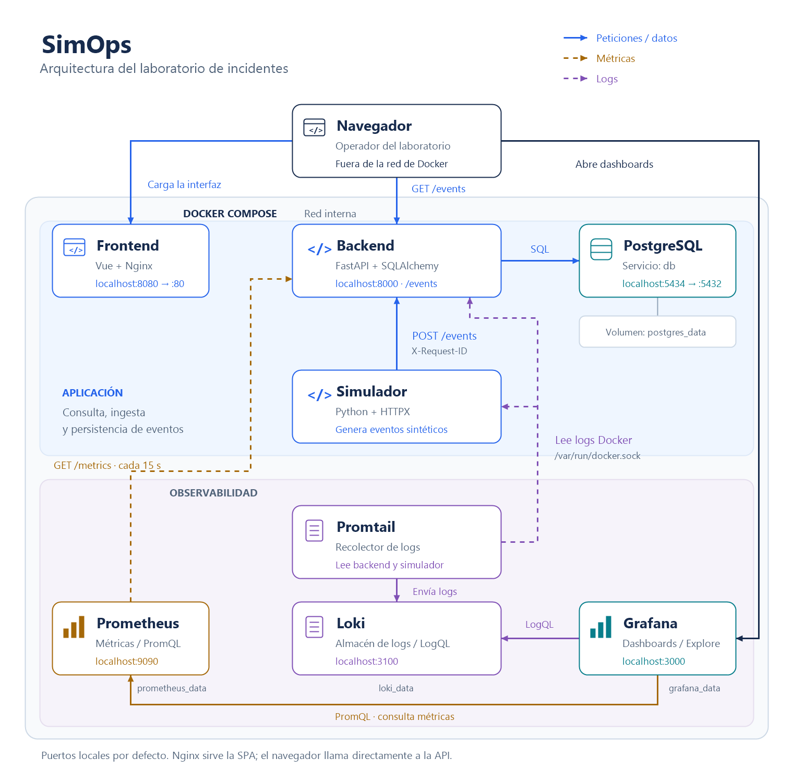

# SimOps

Laboratorio local de operaciones para **provocar fallos, diagnosticar con métricas y logs, recuperar el servicio y escribir postmortems**. Incluye una API de eventos, un simulador de tráfico, un frontend y un stack de observabilidad reproducible con Docker Compose.

## Arquitectura



[Ampliar el diagrama en SVG](docs/diagrams/architecture.svg).

Los puertos mostrados son los publicados en el host por defecto. El navegador consulta directamente la API; Nginx sirve la aplicación web. [Arquitectura detallada](docs/architecture.md): red interna, volúmenes, flujo de escritura, dependencias y superficies de fallo.

## Levantar el sistema

Requisitos: Docker con contenedores Linux y Docker Compose v2. Para la herramienta de ejercicios, Windows PowerShell 5.1 o PowerShell 7.

Desde la raíz, en PowerShell:

```powershell
if (-not (Test-Path .env)) { Copy-Item .env.example .env }
docker compose up --build -d
docker compose ps
powershell -File scripts/lab.ps1 -Action Status
```

En Bash, crear `.env` desde `.env.example` si todavía no existe y ejecutar el mismo comando de Compose. La API aplica las migraciones Alembic antes de arrancar. Esperar `/ready` 200 y comprobar que el frontend recibe eventos nuevos.

| Servicio | Acceso local por defecto |
| --- | --- |
| Frontend | http://localhost:8080 |
| API / Swagger | http://localhost:8000/docs |
| Liveness / readiness | http://localhost:8000/health · http://localhost:8000/ready |
| PostgreSQL | `localhost:5434` |
| Prometheus | http://localhost:9090 |
| Loki | http://localhost:3100/ready |
| Grafana | http://localhost:3000 |

Grafana provisiona los datasources de Prometheus y Loki y el dashboard **SimOps Overview**. Sus credenciales iniciales están en `.env` (`admin` / `admin` en la plantilla local). Cambiarlas en `.env` no cambia automáticamente la contraseña guardada en un volumen Grafana existente.

Para detener el stack conservando datos:

```sh
docker compose down
```

## Primer ejercicio: caída de PostgreSQL

Con el stack sano, abrir frontend y Grafana. Dejar al menos un minuto de tráfico base y escribir una hipótesis sobre qué fallará y qué señal lo detectará.

```powershell
powershell -File scripts/lab.ps1 -Action Drill -Scenario database-down -DurationSeconds 30
```

La herramienta captura estado, logs y respuestas HTTP antes/durante/después; detiene `db`, intenta reactivarlo al terminar y comprueba readiness y lectura. Crea evidencias en `artifacts/lab/` y un borrador de postmortem en `docs/incidents/`. Completar la verificación de escritura y entrega de eventos descrita en [la guía del laboratorio](docs/lab.md).

Durante el fallo, `/health` puede seguir respondiendo 200 mientras `/ready` devuelve 503. El simulador registra entregas fallidas y las descarta: el servicio recuperado acepta nuevos eventos, pero los envíos descartados no se reenvían.

| Escenario | Servicio detenido | Qué practicar |
| --- | --- | --- |
| `database-down` | `db` | Liveness frente a readiness, errores SQL y persistencia |
| `backend-down` | `backend` | Indisponibilidad de API, pérdida de envíos y reinicio de contadores |
| `simulator-down` | `simulator` | Detectar ausencia de tráfico con una API disponible |
| `logs-down` | `promtail` | Detectar pérdida de visibilidad mientras la aplicación funciona |

Cambiar `-Scenario` para repetir los ejercicios. La duración admitida es de 15 a 300 segundos. Ejecutar uno a la vez sobre el Compose local. El script intenta recuperar incluso si falla un paso; si se mata la terminal o falla Docker, recuperar manualmente con `docker compose start <servicio>`.

Otros comandos:

```powershell
powershell -File scripts/lab.ps1 -Action Snapshot
powershell -File scripts/lab.ps1 -Action NewPostmortem -Scenario backend-down
```

Seguir [docs/lab.md](docs/lab.md) para hipótesis, consultas PromQL/LogQL, criterios de recuperación y ejercicios manuales de validación y ráfagas. Usar [la plantilla de postmortem](docs/postmortem-template.md) y guardar los resultados en [el registro de incidentes](docs/incidents/README.md). Repetir un fallo después de cada mejora y comparar resultados.

## Qué se observa y qué se simula

La API expone contadores de ingesta y HTTP, histogramas de duración y logs JSON con `request_id` y `event_id`. Prometheus recolecta cada 15 segundos; Promtail envía a Loki logs del backend y simulador.

Las severidades, `status_code` y `response_time_ms` de los eventos describen servicios ficticios. Aumentar `SIMULATOR_FAILURE_RATE` produce más eventos sintéticos de error; no derriba la API. Para diagnosticar fallos reales, observar códigos HTTP del middleware, `/ready`, `up`, categorías de error y entregas del simulador.

La base actual tiene una instancia por servicio, sin cola, reintentos de aplicación, idempotencia, alertas automáticas ni métricas de recursos. [La arquitectura](docs/architecture.md) explica estos límites para orientar los siguientes ejercicios.

## Configuración

[.env.example](.env.example) contiene los valores locales y [.env.prod.example](.env.prod.example) un punto de partida para despliegue. Compose usa `.env` de la raíz.

| Grupo | Variables |
| --- | --- |
| PostgreSQL | `POSTGRES_DB`, `POSTGRES_USER`, `POSTGRES_PASSWORD`, `POSTGRES_PORT` |
| Puertos web y observabilidad | `BACKEND_PORT`, `FRONTEND_PORT`, `PROMETHEUS_PORT`, `LOKI_PORT`, `GRAFANA_PORT` |
| API | `SIMOPS_ALLOWED_HOSTS`, `SIMOPS_CORS_ORIGINS`, `SIMOPS_LOG_LEVEL`, `SIMOPS_ENVIRONMENT` |
| Frontend | `SIMOPS_API_BASE_URL` |
| Grafana | `GRAFANA_ADMIN_USER`, `GRAFANA_ADMIN_PASSWORD` |
| Simulador | `SIMULATOR_INTERVAL_SECONDS`, `SIMULATOR_FAILURE_RATE`, `SIMULATOR_BURST_RATE`, `SIMULATOR_BURST_MIN_SIZE`, `SIMULATOR_BURST_MAX_SIZE`, `SIMULATOR_SERVICE_NAMES`, `SIMULATOR_ENVIRONMENT`, `SIMULATOR_MAX_RANDOM_DELAY_MS` |

Los puertos admiten valores como `8080` o `127.0.0.1:8080`. Al cambiar el puerto de la API, ajustar también `SIMOPS_API_BASE_URL`; al cambiar el origen del frontend, ajustar `SIMOPS_CORS_ORIGINS`. El frontend genera `config.js` al iniciar el contenedor, sin reconstruir su imagen. Los cambios de entorno se aplican recreando el servicio correspondiente con `docker compose up -d <servicio>`.

## API y desarrollo

Endpoints: `POST /events`, `GET /events`, `GET /events/{id}`, `GET /health`, `GET /ready` y `GET /metrics`. [Contrato de API](docs/api-contract.md) y [modelo de datos](docs/data-model.md).

| Componente | Tecnología / instrucciones |
| --- | --- |
| [Backend](backend/README.md) | FastAPI, SQLAlchemy, Alembic, Pydantic, Uvicorn; Pytest y Ruff |
| [Frontend](frontend/README.md) | Vue 3, Vite, Nginx; ESLint y build de producción |
| [Simulador](simulator/README.md) | Python, HTTPX; generación secuencial de eventos y ráfagas |
| [Infraestructura](infra/README.md) | PostgreSQL, Prometheus, Grafana, Loki y Promtail en Compose |

[GitHub Actions](.github/workflows/ci.yml) ejecuta `backend-quality`, `backend-security` (Bandit y pip-audit), `frontend-quality` y `docker-build` (validación de Compose y construcción de imágenes). Trabajar con ramas cortas y PRs a `main`; estos son los checks existentes para protección de rama.

Para validar la herramienta de ejercicios sin detener contenedores reales:

```powershell
powershell -NoProfile -File scripts/tests/lab.tests.ps1
```

## Estructura

```text
backend/              API, migraciones y tests
frontend/             SPA y Nginx
simulator/            Productor de eventos sintéticos
infra/                Configuración de métricas, logs y dashboards
scripts/lab.ps1       Estado, capturas, ejercicios y borradores
scripts/tests/        Validación de la herramienta con Docker simulado
docs/architecture.md  Diagramas y comportamiento ante fallos
docs/diagrams/        Dibujos de arquitectura y flujo en PNG y SVG
docs/lab.md           Procedimientos del laboratorio
docs/incidents/       Postmortems de ejercicios ejecutados
artifacts/lab/        Evidencias locales, excluidas de Git
docker-compose.yml    Stack local
```

## Base de seguridad

Backend y simulador usan usuarios no root y sistemas de archivos de solo lectura. Compose configura `no-new-privileges` y rotación de logs; la API valida hosts y aplica headers de seguridad, al igual que Nginx.

Antes de un despliegue compartido o público, cambiar `POSTGRES_PASSWORD`, `GRAFANA_ADMIN_PASSWORD` y `SIMOPS_ALLOWED_HOSTS`. El laboratorio local aún requiere trabajo adicional para exponerlo: proxy/TLS, control de acceso, backups y monitoreo externo.
