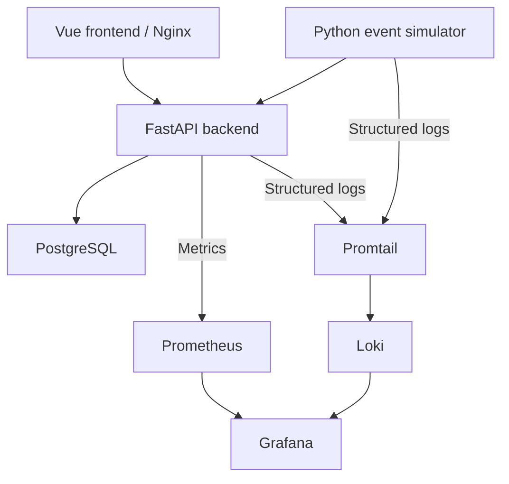

# SimOps

[](https://github.com/Pizofh/SimOps/actions/workflows/ci.yml)

**An observable operations lab for exploring event ingestion, service health, and delivery quality.**

SimOps brings together a FastAPI API, a Vue interface, a traffic simulator, PostgreSQL, and a provisioned observability stack. It is a DevOps portfolio project built to make the complete application lifecycle easy to inspect: start the services, generate operational events, query the API, and follow metrics and logs in Grafana.

## Engineering Highlights

| Capability | Implementation | Why it matters |
| --- | --- | --- |
| Reproducible environments | Docker Compose with service health checks and persistent volumes | A documented starting point for running the same stack locally |
| Operational visibility | Prometheus metrics, structured logs, Loki, and provisioned Grafana dashboards | Inspect request rates, latency, errors, and application logs together |
| Delivery validation | GitHub Actions with linting, tests, security checks, and image builds | Validate application quality and container configuration on changes |
| Database lifecycle | PostgreSQL and versioned Alembic migrations | Keep schema changes explicit and repeatable |
| Runtime configuration | Environment settings and frontend runtime API configuration | Change deployment settings without rebuilding the frontend |
| Container hardening | Non-root backend and simulator, read-only filesystems, and log rotation | Apply practical operational controls to a small service stack |

## Runtime Topology



The simulator generates operational event records, including simulated failures and bursts. These records are distinct from actual failures of the running API.

## What The Project Includes

- FastAPI backend for ingesting and querying operational events
- Vue 3 frontend for browsing stored events
- standalone Python simulator that continuously generates traffic
- PostgreSQL persistence with Alembic migrations
- Dockerfiles for each application service
- a full Docker Compose stack for local development and demo environments
- Prometheus, Loki, Promtail, and Grafana for local observability
- GitHub Actions CI for quality, security, and container build validation

## Tech Stack

- Backend: FastAPI, SQLAlchemy, Alembic, Pydantic, Uvicorn
- Frontend: Vue 3, Vite, ESLint, Nginx
- Database: PostgreSQL
- Simulator: Python, HTTPX
- Containers: Docker, Docker Compose
- Observability: Prometheus, Grafana, Loki, Promtail
- CI: GitHub Actions

## Quick Start

Requirements: Git, Docker, and Docker Compose.

```bash
git clone https://github.com/Pizofh/SimOps.git
cd SimOps
cp .env.example .env
docker compose up --build
```

Default local endpoints:

- frontend: `http://localhost:8080`
- backend: `http://localhost:8000`
- PostgreSQL: `localhost:5434`
- Prometheus: `http://localhost:9090`
- Loki: `http://localhost:3100`
- Grafana: `http://localhost:3000`

To stop the stack:

```bash
docker compose down
```

The frontend calls the backend through the browser, and the simulator continuously sends events into the API.

## Five-Minute Walkthrough

1. Open the frontend at `http://localhost:8080` and browse the events produced by the simulator.
2. Check `http://localhost:8000/health` and `http://localhost:8000/ready` to inspect application health and database readiness.
3. Sign in to Grafana at `http://localhost:3000` using the credentials configured in `.env`, then open the provisioned **SimOps Overview** dashboard.
4. Compare request activity and p95 request latency with backend and simulator logs in Grafana Explore.
5. Change `SIMULATOR_INTERVAL_SECONDS` or `SIMULATOR_BURST_RATE` in `.env`, run `docker compose up -d simulator`, and observe how traffic changes.

## Configuration

The repository includes two environment templates:

- `.env.example`: local development defaults
- `.env.prod.example`: a deployment-oriented starting point for a small VM or reverse-proxy setup

Root Compose variables:

- `POSTGRES_DB`
- `POSTGRES_USER`
- `POSTGRES_PASSWORD`
- `POSTGRES_PORT`
- `BACKEND_PORT`
- `FRONTEND_PORT`
- `PROMETHEUS_PORT`
- `LOKI_PORT`
- `GRAFANA_PORT`
- `GRAFANA_ADMIN_USER`
- `GRAFANA_ADMIN_PASSWORD`
- `SIMOPS_ALLOWED_HOSTS`
- `SIMULATOR_INTERVAL_SECONDS`
- `SIMULATOR_FAILURE_RATE`
- `SIMULATOR_BURST_RATE`
- `SIMULATOR_BURST_MIN_SIZE`
- `SIMULATOR_BURST_MAX_SIZE`
- `SIMULATOR_SERVICE_NAMES`
- `SIMULATOR_ENVIRONMENT`
- `SIMULATOR_MAX_RANDOM_DELAY_MS`

Notes:

- Port variables are passed directly into the Compose port mapping, so they can be either bare ports such as `8080` or bind-address forms such as `127.0.0.1:8080`.
- The containerized frontend reads `SIMOPS_API_BASE_URL` at runtime, so you can point the same frontend image at a different backend without rebuilding it.
- If you change the frontend origin for a public deployment, also review the backend CORS configuration in [docker-compose.yml](docker-compose.yml).

## API

Implemented endpoints:

- `POST /events`
- `GET /events`
- `GET /events/{id}`
- `GET /health`
- `GET /ready`
- `GET /metrics`

Detailed contract:

- [docs/api-contract.md](docs/api-contract.md)

## Observability

Grafana is provisioned automatically with:

- a Prometheus datasource
- a Loki datasource
- the `SimOps Overview` dashboard

The current baseline focuses on application-level signals:

- backend counters for events, requests, and error conditions
- backend request duration histograms used for overall p95 latency
- structured logs from the backend and simulator

Current scope does not include host or container resource metrics such as CPU, memory, disk, or network usage.

Grafana credentials come from the root `.env` file:

- `GRAFANA_ADMIN_USER`
- `GRAFANA_ADMIN_PASSWORD`

If the `grafana_data` volume already exists, changing those values later will not reset the saved admin password automatically.

## CI Pipeline

The repository includes a GitHub Actions workflow at [.github/workflows/ci.yml](.github/workflows/ci.yml).

Implemented checks:

- `backend-quality`: installs the backend, runs Ruff, and executes Pytest
- `backend-security`: runs Bandit and `pip-audit`
- `frontend-quality`: installs frontend dependencies, runs ESLint, and verifies the production build
- `docker-build`: validates `docker-compose.yml` and builds the `backend`, `frontend`, and `simulator` images

Recommended Git workflow:

- create short-lived branches such as `feature/<name>`, `fix/<name>`, or `chore/<name>`
- open pull requests into `main`
- keep `main` protected and merge only when required checks pass

Recommended branch protection for `main`:

1. Require a pull request before merging.
2. Require status checks to pass before merging.
3. Mark these checks as required:
   - `backend-quality`
   - `backend-security`
   - `frontend-quality`
   - `docker-build`
4. Optionally require branches to be up to date before merging.

## Repository Structure

| Path | Responsibility |
| --- | --- |
| `backend/` | FastAPI application, database migrations, and backend tests |
| `frontend/` | Vue interface, runtime configuration, and Nginx serving |
| `simulator/` | Configurable operational event generator and its tests |
| `infra/` | Prometheus, Grafana, Loki, and Promtail configuration |
| `docs/` | Architecture, API contract, and data model |
| `.github/workflows/ci.yml` | Quality, security, and container validation |
| `docker-compose.yml` | Service definitions, health checks, networking, and volumes |

## Documentation

- [docs/architecture.md](docs/architecture.md)
- [docs/api-contract.md](docs/api-contract.md)
- [docs/data-model.md](docs/data-model.md)
- [infra/README.md](infra/README.md)
- [backend/README.md](backend/README.md)
- [frontend/README.md](frontend/README.md)
- [simulator/README.md](simulator/README.md)

## Hardening Notes

The current baseline includes:

- non-root application containers for `backend` and `simulator`
- `no-new-privileges` enabled in Compose
- read-only root filesystems for `backend` and `simulator`
- Docker log rotation for all long-running services
- backend trusted host validation through `SIMOPS_ALLOWED_HOSTS`
- backend and frontend security headers for common browser protections

Before any shared or internet-exposed deployment, change at least:

- `POSTGRES_PASSWORD`
- `GRAFANA_ADMIN_PASSWORD`
- `SIMOPS_ALLOWED_HOSTS`

## Near-Term Improvements

- deploy the stack to a small VM or on-demand cloud environment
- add a reverse proxy and TLS for public access
- separate database migrations from the backend startup command
- expand observability with alerts and host or container resource metrics
