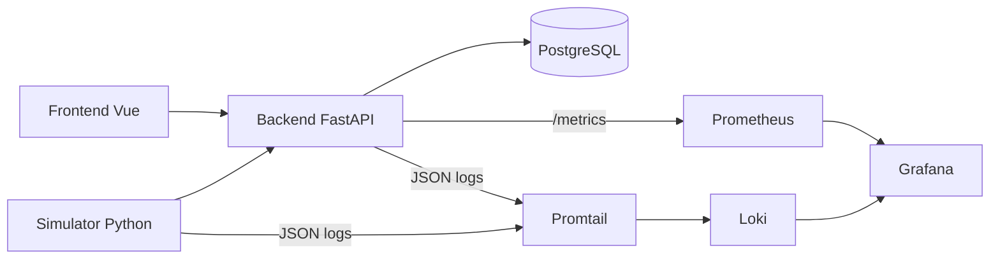

# Arquitectura de SimOps

## Visión general

SimOps es una plataforma ligera para recibir, almacenar y visualizar eventos operativos simulados. Está diseñada para demostrar capacidades DevOps de nivel jr-mid con una arquitectura simple, separada y explicable en entrevista.

## Objetivos de arquitectura

- mostrar integración entre componentes desacoplados
- habilitar despliegue local reproducible con Docker Compose
- instrumentar observabilidad real sobre backend y simulador
- mantener una base lo bastante simple para construirla en tiempo limitado

## Componentes

### Frontend

- Vue 3 + Vite
- consume el backend por HTTP
- lista eventos, aplica filtros simples y muestra detalle

### Backend

- FastAPI como API monolítica
- SQLAlchemy para acceso a datos
- Alembic para migraciones
- Pydantic para validación y contratos
- expone `/health`, `/ready` y `/metrics`
- emite logs estructurados JSON

### PostgreSQL

- persistencia principal de eventos
- un solo esquema al inicio
- índices simples orientados a consulta reciente y filtros básicos

### Simulator

- servicio Python separado
- envía eventos periódicos al backend
- configurable por variables de entorno
- puede simular fallos, latencia y bursts

### Observabilidad

- Prometheus scrapea métricas del backend
- Promtail recolecta logs de backend y simulator
- Loki centraliza logs
- Grafana unifica visualización de métricas y logs

## Diagrama conceptual

## Decisiones técnicas clave

## 1. Backend monolítico

Se elige una sola API para evitar complejidad operativa temprana. Esto mantiene el foco en contenedorización, pipelines, observabilidad y despliegue reproducible.

## 2. Frontend separado

Se separa del backend para demostrar arquitectura cliente-servidor, build independiente y variables por entorno sin convertir el proyecto en una SPA compleja.

## 3. Simulator separado

Es importante que el generador de tráfico no viva dentro del backend. Así se demuestra integración entre servicios y se facilita simular comportamiento de sistemas externos.

## 4. Compose-first

Docker Compose será la forma oficial de levantar el entorno local completo. Esto deja una ruta clara a una futura fase de Kubernetes sin imponer esa complejidad desde el MVP.

## 5. Observabilidad real desde el MVP

No se deja como mejora futura. El valor del proyecto está precisamente en mostrar métricas, logs centralizados y dashboards básicos en una topología simple.

## 6. CI de validación, no CD complejo

Se prioriza un pipeline que valide calidad, seguridad y build. El despliegue automático a entornos remotos se deja como fase futura opcional.

## Preparación para Kubernetes

No se implementará Kubernetes en el MVP, pero la arquitectura quedará preparada mediante:

- servicios separados por responsabilidad
- configuración por variables de entorno
- healthchecks compatibles con probes
- volúmenes y dependencias claramente identificados
- carpeta futura `k8s/` o `docs/k8s-notes.md` sin dedicarle esfuerzo excesivo ahora

## Decisiones explícitamente descartadas

- microservicios de negocio
- mensajería asíncrona inicial
- autenticación y autorización complejas
- secretos externos o vault desde el inicio
- IaC pesada para un MVP local
- GitOps

