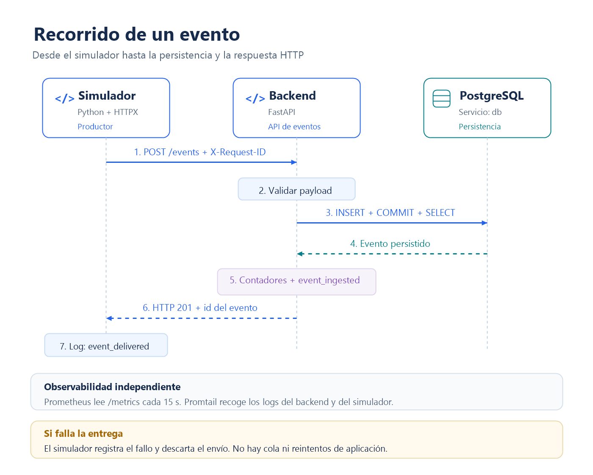

# Arquitectura de SimOps

SimOps es un laboratorio local de ingesta de eventos. Esta vista describe los servicios y conexiones que existen en [docker-compose.yml](../docker-compose.yml).

## Diagrama de componentes

Azul: peticiones y datos. Ocre: métricas. Morado: logs. Las flechas indican quién inicia la solicitud o lectura; los puertos son los valores locales por defecto.

[Abrir o descargar la versión SVG ampliable](diagrams/architecture.svg).

El JavaScript del navegador llama directamente al backend. Nginx sirve la SPA y su configuración de runtime; no actúa como proxy de la API. `SIMOPS_API_BASE_URL` debe ser una URL accesible desde el navegador, mientras que el simulador usa `http://backend:8000/events` dentro de Docker.

`payments-api`, `auth-api` e `inventory-worker` son etiquetas de eventos generados, no contenedores adicionales ni dependencias reales.

## Recorrido de una escritura

[Abrir o descargar el flujo en SVG](diagrams/event-flow.svg). Leer de arriba hacia abajo; las flechas discontinuas entre servicios representan respuestas.

La API valida antes de persistir y cuenta eventos después del commit. Si se pierde la respuesta después del commit, el cliente puede registrar un fallo aunque el evento exista; no hay clave de idempotencia para resolver esa ambigüedad. Los contadores del backend se reinician al reiniciar su proceso; los datos de PostgreSQL permanecen en el volumen.

## Salud y dependencias

| Señal | Qué verifica | Qué puede pasar por alto |
| --- | --- | --- |
| Backend `/health` | El proceso responde | Base de datos, esquema, escritura y flujo de eventos |
| Backend `/ready` | Puede ejecutar `SELECT 1` en PostgreSQL | Migraciones, permisos de escritura y generación de eventos |
| Frontend `/health` | Nginx responde | Conectividad del navegador con la API y CORS |
| Prometheus `up{job="simops-backend"}` | El scraper puede leer `/metrics` | Estado de la base de datos |
| `backend_up` | El proceso ha iniciado | Disponibilidad desde fuera; no se puede recolectar cuando está caído |
| Eventos nuevos + `event_delivered` | El flujo de ingesta está activo | Entrega garantizada de todos los eventos |

Compose espera al healthcheck de PostgreSQL para arrancar el backend. Su comando ejecuta `alembic upgrade head` antes de Uvicorn. Frontend, simulador y Prometheus esperan el healthcheck del backend, que usa **`/health`, no `/ready`**. `depends_on` ordena el arranque; no detiene las aplicaciones dependientes cuando cae la base de datos. `restart: unless-stopped` no revive un contenedor detenido explícitamente con `docker compose stop` ni reinicia por sí solo un contenedor marcado como unhealthy.

## Superficies para experimentar

| Componente detenido | Impacto esperado | Señal útil | Recuperación |
| --- | --- | --- | --- |
| `db` | Lecturas/escrituras fallan; proceso API sigue vivo | `/ready` 503, HTTP 5xx, `event_persist_failed` | `docker compose start db` |
| `backend` | Sin consulta ni ingesta | Fallos de conexión, `up` 0, `event_delivery_failed` | `docker compose start backend` |
| `simulator` | API disponible, sin nuevos eventos automáticos | Tasa de ingesta cae; consultas siguen funcionando | `docker compose start simulator` |
| `promtail` | Servicio disponible, recolección de logs interrumpida | Logs Docker avanzan mientras Loki deja de recibirlos | `docker compose start promtail` |

Los procedimientos y criterios de recuperación están en [el laboratorio de incidentes](lab.md).

## Límites de la base actual

- Una instancia por servicio y una sola base de datos; sin alta disponibilidad.
- Sin cola, reintentos de aplicación, DLQ ni idempotencia en la ingesta.
- Métricas de aplicación; no hay exporters de PostgreSQL, host o recursos de contenedores.
- Sin alertas automáticas ni sondeo externo de `/ready`; la detección inicial es manual.
- `errors_total` combina categorías de eventos sintéticos y fallos de infraestructura. No es un contador exclusivo de HTTP 5xx.
- Promtail recoge únicamente backend y simulador. Sus posiciones viven en `/tmp`, sin volumen persistente; comprobar posibles huecos o duplicados después de reiniciarlo.
- Volúmenes locales persistentes para PostgreSQL, Prometheus, Loki y Grafana; no hay procedimiento de backup/restauración implementado.
- Imágenes de observabilidad con tag `latest`; registrar versiones o digests al comparar ejercicios entre máquinas.

Estas limitaciones sirven como punto de partida para mejoras después de reunir evidencia en los ejercicios.

## Editar los dibujos

Los SVG son la fuente editable de los dibujos y permiten ampliar sin perder definición. Para cambiar cajas, textos, conexiones o colores, editar el SVG correspondiente en `docs/diagrams/` y exportar su PNG con el mismo nombre. Los PNG se muestran directamente en el README y esta página.
